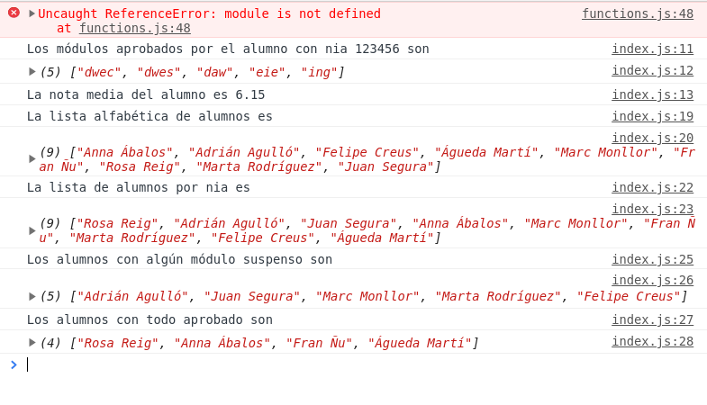
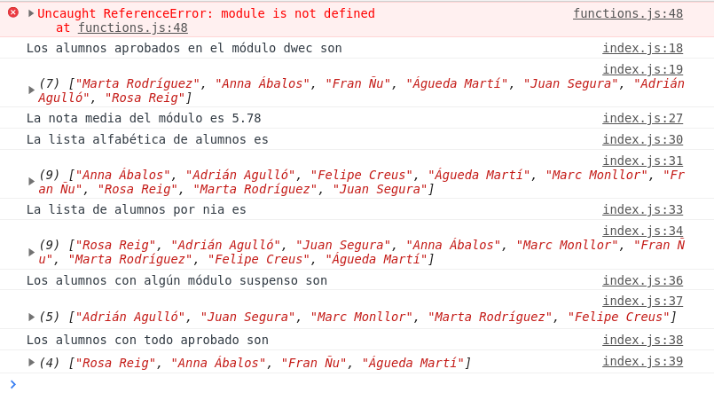

# Bloc 1: Javascript. UT 2: Arrays
## Práctica 2.2 - Notas de Alumnos
Vamos a hacer un programa para trabajar con las notas de los alumnos que tendremos almacenadas en un array de objetos llamado `datosAlumnos`. El contenido de cada elemento del array es un objeto como el siguiente:

```json
{
	"id":1,
	"nia":165432,
	"alumno":{
		"nombre":"Marta",
		"apellido":"Rodríguez"
	},
	"notas":[
		{"modulo":"dwec","nota":7.2},
		{"modulo":"dwes","nota":4.8},
		{"modulo":"diw","nota":8.5},
		{"modulo":"daw","nota":9.3},
		{"modulo":"eie","nota":6},
		{"modulo":"ing","nota":6.1}
	]
}
```

Como aún no sabemos cargar datos del servidor guardaremos esa variable en un fichero que llamaremos `datos.js`.

El programa hará lo siguiente:
- pide al usuario que introduzca el nombre del módulo o el NIA del alumno del que mostrar la información
- si el usuario introduce un valor numérico supondremos que es un NIA y si no supondremos que es un nombre de módulo
- si introduce un alumno muestra por consola
  - los módulos aprobados por el alumno
  - la nota media del alumno
- si introduce un módulo muestra por consola
  - los alumnos aprobados de ese módulo
  - la nota media del módulo
- en ambos casos después muestra por consola
  - la lista de alumnos ordenada alfabéticamente
  - la lista de alumnos ordenada por nia
  - la lista de alumnos con algún módulo suspenso
  - la lista de alumnos con todo aprobado

Ejemplo de la consola introduciendo un nia:



Ejemplo de la consola introduciendo un módulo:



Para poder pasar los tests a nuestro programa y comprobar si funciona repartiremos el código en 2 ficheros JS distintos dentro del directorio `/src`:
- **`index.js`**: es el programa principal que pregunta al usuario los datos (el módulo o el alumno) y, si ha introducido algo, llama a las distintas funciones y muestra por consola la información necesaria
- **`functions.js`**: este fichero sólo incluye las funciones
  - **buscaAlumno**: recibe el array de datos y el NIA de un alumno y devuelve el objeto con todos los datos de dicho alumno (ej. _{id: 7, nia: 123456, alumno: {...}, notas: {...}}_)
  - **modulosAprobadosDelAlumno**: recibe el array con las notas de un alumno y devuelve un array con el nombre de los módulos aprobados por el alumno (ej. _['dwes', 'daw']_)
  - **media**: recibe un array de números y devuelve la media de los mismos con 2 decimales
  - **ordenaAlumnosPorNia**: recibe el array de datos y devuelve el array de datos ordenado por el nia de los alumnos
  - **ordenaAlumnosPorApellido**: recibe el array de datos y devuelve el array de datos pero ordenado por apellido de los alumnos
  - **alumnosConSuspensos**: recibe el array de datos y devuelve un array con el nombre y apellidos de los alumnos con algún módulo suspendido (cada elemento será una cadena, ej. _['Juan Segura', 'Marta Rodríguez']_)
  - **alumnosConTodoAprobado**: recibe el array de datos y devuelve un array con el nombre y apellidos de los alumnos con todos los módulos aprobados
  - alumnosAprobadosDelModulo: recibe el array de datos y el nombre de un módulo y devuelve un array con el nombre y apellidos de los alumnos aprobados

Recuerda que para poder testear el código como en el ejercicio anterior al final del fichero debemos añadir la instrucción:

```javascript
module.exports = {
    buscaAlumno,
    modulosAprobadosDelAlumno,
    media,
    ordenaAlumnosPorNia,
    ordenaAlumnosPorApellido,
    alumnosConSuspensos,
    alumnosConTodoAprobado,
    alumnosAprobadosDelModulo
}
```

En el fichero _**index.html**_ deberemos enlazar los 3 scripts: primero el _datos.js_, luego el _functions.js_ y por último el _index.js_.

**IMPORTANTE**: no usaremos **ningún _for_** para recorrer los arrays. Siempre que sea posible usaremos _Functional Programming_.

**RECUERDA**: seguir haciendo todas las buenas prácticas que se indicaban en el ejercicio anterior.

**MUY IMPORTANTE**: pasa los tests como se explicó en el ejercicio de la frase para asegurarte aprobar este ejercicio.
